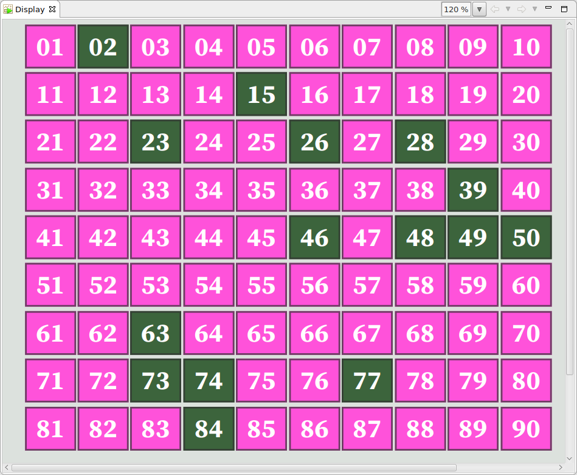

Bingo Main Board (1-90) EPICS IOC
====

This is the extreme simple IOC for display the Bingo Board from 1 to 90. Each number is BI, is controlled by `caput`. 


## How to ON or OFF each number


* Turn on number 20
```
bash tools/turnon.bash -v 20 
```

* Turn off the number 20
```
bash tools/turnon.bash -v 20 -f
```

* one can use `caput` directly.

```
caput Bingo90:20 1
```

* one can turn off all selected numbers

```
bash tools/turnoff_all.bash
```

* Note that PV is the hard-coded in OPI, and scripts.

## Screen Shot

| |    
| :---: |    
| **Figure 1** Bingo 90 Main Board Screen based on CSS Bob. |   
